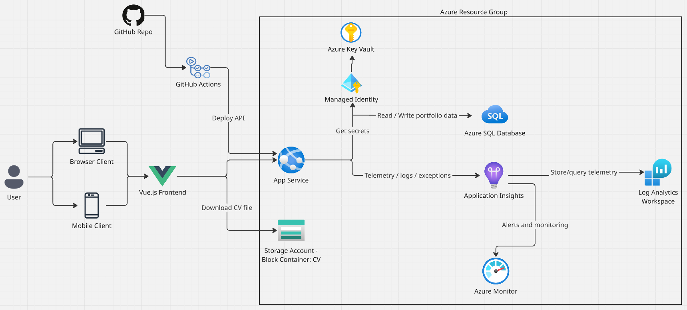

# System Design

## Overview

This document describes the high-level system design for the Rusiru Portfolio API.

The API is designed as a lightweight, maintainable ASP.NET Core backend service hosted on Azure. It serves portfolio content, connects to Azure SQL Database for persistent data, uses Azure Key Vault for secrets, stores the CV file in Azure Blob Storage, and sends telemetry to Application Insights.

---

## System Design Diagram

---

## Request Flow

1. The user accesses the portfolio through a browser or mobile client.
2. The Vue.js frontend sends API requests to the ASP.NET Core API hosted on Azure App Service.
3. The API reads and writes portfolio data using Azure SQL Database.
4. The API accesses secrets from Azure Key Vault using Managed Identity.
5. The CV file is stored in Azure Blob Storage and can be downloaded directly by the frontend.
6. API logs, exceptions, request telemetry, and dependency telemetry are sent to Application Insights.
7. Telemetry is stored in Log Analytics Workspace and monitored through Azure Monitor.

---

## Deployment Flow

1. Code is pushed to the GitHub repository.
2. GitHub Actions builds and tests the API.
3. If the pipeline succeeds, the API is deployed to Azure App Service.
4. The `/api/health` endpoint is used to verify the deployment.

---

## Trade-offs and Design Decisions

### No API Management or Application Gateway initially

I will not use Azure API Management or Application Gateway in the initial version because this API is small and does not currently need gateway-level routing, subscriptions, or advanced traffic management.

Authentication, authorization, rate limiting, validation, and error handling will be handled inside the API project. These services can be added later if the API needs centralised gateway policies, WAF, or more advanced routing.

### App Service instead of Container Apps initially

I will use Azure App Service for the first deployment because this is a standard ASP.NET Core Web API and App Service keeps the deployment simple.

Docker support is still included for local development and future flexibility, but the first cloud deployment does not require a container-first hosting model.

### Direct CV download from Blob Storage

The CV file will be stored in Azure Blob Storage and downloaded directly by the frontend.

The API will not proxy the CV file in the initial version because the CV is intended to be publicly downloadable. This reduces unnecessary API calls and keeps file delivery simple.
